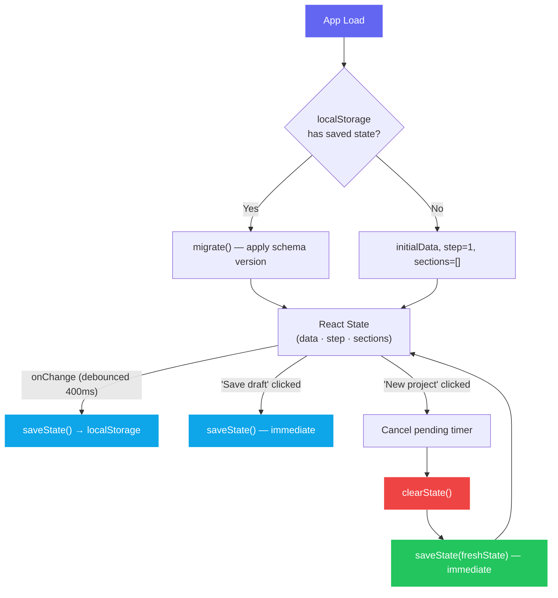
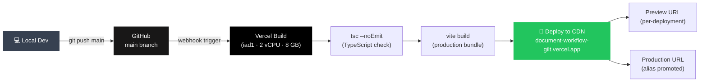

# SpecFlow

> A guided web app for SAP consultants to draft **Functional Specification Documents (FSD)** from project context, business requirements, user stories, and scope boundaries — in four structured steps.

[](https://document-workflow-gilt.vercel.app)
[](https://github.com/lalitsonawane/Document-Workflow)
[](https://vercel.com/apptonics-projects/document-workflow)
[](https://www.typescriptlang.org/)
[](https://react.dev/)
[](https://vitejs.dev/)

---

## 🚀 Live Deployment

| Environment | URL |
|-------------|-----|
| **Production** | [https://document-workflow-gilt.vercel.app](https://document-workflow-gilt.vercel.app) |
| **Vercel Dashboard** | [vercel.com/apptonics-projects/document-workflow](https://vercel.com/apptonics-projects/document-workflow) |
| **GitHub Repository** | [github.com/lalitsonawane/Document-Workflow](https://github.com/lalitsonawane/Document-Workflow) |

> **Auto-deploy enabled** — every push to the `main` branch triggers a new Vercel production deployment automatically.

---

## 🔄 Application Workflow

The wizard guides users through four sequential steps to produce a complete FSD:

```mermaid
flowchart LR
    A([🏠 Start]) --> B

    subgraph B["Step 1 · Project Setup"]
        B1[SAP Module]
        B2[Project Name]
        B3[FSD Title]
        B4[Author / Version]
    end

    subgraph C["Step 2 · Requirements"]
        C1[Business Requirement]
        C2[User Stories]
        C3[Acceptance Criteria]
    end

    subgraph D["Step 3 · Review Scope"]
        D1[In-Scope Items]
        D2[Out-of-Scope Items]
        D3[Assumptions]
        D4[Dependencies]
    end

    subgraph E["Step 4 · Functional Spec"]
        E1[Generated FSD]
        E2[Editable Sections]
        E3[Export .docx]
        E4[Print / PDF]
    end

    B --> C --> D --> E
    E --> F([✅ Complete])

    style A fill:#6366f1,color:#fff,stroke:none
    style F fill:#22c55e,color:#fff,stroke:none
```



### State & Persistence Flow



---

## 🏗️ CI/CD Pipeline



### Bundle sizes (production)

| Asset | Raw | Gzipped |
|-------|-----|---------|
| `index.js` (React + app) | 220 KB | 69 KB |
| `docxGenerator.js` (lazy) | 345 KB | 99 KB |
| `index.css` | 14 KB | 3.7 KB |

---

## 🛠 Tech Stack

| Layer | Technology |
|-------|------------|
| UI framework | React 19 + React DOM 19 |
| Build tool | Vite 6 + `@vitejs/plugin-react` |
| Language | TypeScript (strict mode) |
| Styling | Vanilla CSS with custom properties |
| Export | `docx` library — real `.docx` (lazy-loaded / code-split) |
| Tests | Vitest + `@testing-library/react` + jsdom |
| Lint / Format | ESLint (typescript-eslint flat config) + Prettier |
| Hosting | Vercel (SPA rewrite via `vercel.json`) |

---

## 🖥 Run Locally

```bash
# 1. Clone
git clone https://github.com/lalitsonawane/Document-Workflow.git
cd Document-Workflow

# 2. Install dependencies
npm install

# 3. Start dev server
npm run dev
```

Open the URL Vite prints — usually **http://localhost:5173**.

---

## 🧱 Build & Preview

```bash
npm run build     # TypeScript check + Vite production build → dist/
npm run preview   # Serve the dist/ folder locally
```

---

## 📦 Deploy to Vercel

### Option A — Automatic (GitHub integration, already configured)

Push to `main` — Vercel picks it up automatically.

```bash
git push origin main
```

### Option B — Manual via Vercel CLI

```bash
# Install CLI (one-time)
npm i -g vercel

# Deploy to production
vercel --prod
```

### Option C — Vercel Dashboard

1. Go to [vercel.com/new](https://vercel.com/new)
2. Import the `lalitsonawane/Document-Workflow` GitHub repository
3. Framework preset: **Vite** (auto-detected)
4. Build command: `npm run build`
5. Output directory: `dist`
6. Click **Deploy**

> The [`vercel.json`](./vercel.json) at the repo root configures SPA fallback routing so page refreshes never return a 404.

```json
{
  "rewrites": [{ "source": "/(.*)", "destination": "/index.html" }]
}
```

---

## 📁 Project Structure

```
.
├── vercel.json              # Vercel SPA rewrite config
├── vite.config.ts           # Vite + Vitest config
├── tsconfig.json            # TypeScript strict config
├── eslint.config.js         # ESLint flat config
├── .prettierrc              # Prettier config
└── src/
    ├── lib/
    │   ├── defaults.ts      # initialData and initialStories
    │   ├── buildSections.ts # FSD section generation logic
    │   ├── storage.ts       # localStorage load/save/clear with schema versioning
    │   ├── readiness.ts     # Completion readiness checks
    │   ├── validation.ts    # Step advance validation
    │   ├── exportDoc.ts     # Export orchestrator
    │   └── docxGenerator.ts # .docx generation (lazy-loaded)
    ├── components/
    │   ├── Stepper.tsx      # 4-step progress nav
    │   ├── Setup.tsx        # Step 1 — project metadata
    │   ├── Requirements.tsx # Step 2 — requirement + user stories
    │   ├── Review.tsx       # Step 3 — scope / assumptions
    │   ├── Spec.tsx         # Step 4 — generated FSD editor
    │   ├── Readiness.tsx    # Sidebar readiness panel
    │   ├── CompletionPanel.tsx # Post-generation actions
    │   ├── StoryRow.tsx     # Drag-and-drop story row
    │   ├── Field.tsx        # Labelled input/select
    │   ├── Icon.tsx         # SVG icon set
    │   └── ErrorBoundary.tsx
    ├── types.ts             # Shared TypeScript interfaces & types
    ├── App.tsx              # Root component — state, routing, persistence
    ├── main.tsx             # Entry point (createRoot)
    ├── styles.css           # All styles (CSS custom properties)
    └── test-setup.ts        # Vitest + jest-dom setup
```

---

## 🧪 Tests

```bash
npm test              # Run all tests once (CI mode)
npm run test:watch    # Watch mode
npm run test:ui       # Vitest browser UI
```

**38 tests** across 5 files:

| File | Coverage |
|------|----------|
| `buildSections.test.ts` | FSD section generation |
| `storage.test.ts` | Schema versioning + migration |
| `readiness.test.ts` | Readiness check logic |
| `validation.test.ts` | Step-advance validation |
| `App.test.tsx` | Component rendering |

---

## ⌨️ Commands Reference

| Command | Purpose |
|---------|---------|
| `npm run dev` | Start Vite dev server |
| `npm run build` | Typecheck + build for production |
| `npm run preview` | Serve production build locally |
| `npm run typecheck` | Run `tsc --noEmit` only |
| `npm run lint` | Run ESLint on all files |
| `npm run format` | Format all files with Prettier |
| `npm run format:check` | Check formatting without writing |
| `npm test` | Run Vitest once (CI mode) |
| `npm run test:watch` | Run Vitest in watch mode |
| `npm run test:ui` | Run Vitest with browser UI |

> **Before committing:** `npm run typecheck && npm run lint && npm test && npm run build`

---

## ✨ Features

- **Validation gating** — Continue / Generate disabled until required fields are filled
- **Draft persistence** — Auto-saves to `localStorage` (debounced 400ms, versioned schema); "New project" cleanly resets all state
- **Drag-to-reorder** — User stories reordered via native HTML5 drag-and-drop
- **Restore defaults** — Reset stories to default SAP AP examples at any time
- **Real `.docx` export** — Generated via the `docx` library (code-split, lazy-loaded)
- **Print / PDF** — One-click browser print of the generated specification
- **Mobile readiness** — Compact progress bar replaces the sidebar on small screens
- **ErrorBoundary** — Catches unexpected render errors with a reload prompt
- **Accessibility** — Stepper uses `aria-current="step"` on the active step

---

## 📄 License

MIT
